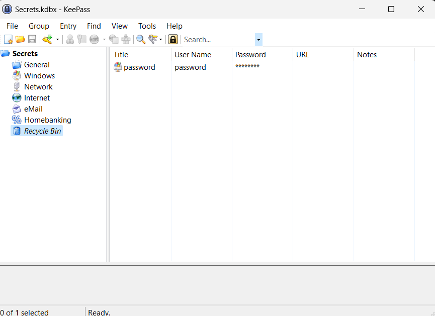

# H4Gr1n

**Description**:
The Griffin family's personal computer encountered a significant security breach.They promptly took a memory dump, capturing the system's state at the time of the intrusion.

Help find the following:
``` 
        Question 1: What is the password manager used by Griffins.Format -  ['password_manager_name_with_version_all_lower cases'] 
        Question 2: Retrieve the password of the password manager. Format -  ['Password_manager_password' ] 
        Question 3:What is the vulnerability found in password manager -  Format -  ['CVE-XXXX-XXXX'] 
        Question 4: Find the key that was removed from password manager - Format-['removed_file_password']
```
Answering the above question will give you the final flag.

**Author: [hrippi.x_](https://twitter.com/hrippix_)**

**Solution**:
As a raw file is given the memory dump can be analayzed using the volatility3 framework.

Going through the processes we find Keepass as the only password manager present-`KeePass`
Filescanning for keepass shows you the .exe with its version tagged on it.

Ans1) KeePass2.53.1

To retrieve the password from the password manager while finding for ways to recover the password we come across the cve for KeePass 2023.
 
Going through the blogs we can find that when the content of the KeePass text box is entered, a managed string is created in its process memory. Whose memory if dumped,will lead to the leakage of the master password.

Search for placeholder xCFx25 based on known information. As shown in the figure below, it is found that a placeholder appears first, followed by the plaintext character


This gives you the complete password of Keepass:

Ans2) `allsecretslieinhere_for4r3ason_louis`

From the research done for the second question the 3rd answer should be quite easy as it is the cve number that has been asked :

Ans3) `CVE-2023-32784`

For the next part you have to dump Keepass from memory using the volatility framework.

```
python3 vol.py -f chall.raw windows.filescan | grep .kdbx
```


Dump the Secrets.kdbx using the command:
```
python3 vol.py -f chall.raw windows.dumpfiles -o output_file --virtaddr 0x8c0ae33b7c70
```

After retrieving the password manager check the key that was deleted 


Ans4) `U6Vgc6dhNGbw3jSB5vzS`
Here you go the last answer needed to get the final flag.

### Flag
```shaktictf{C0ng0!_m4st3r_cv31s7_34256865}```
